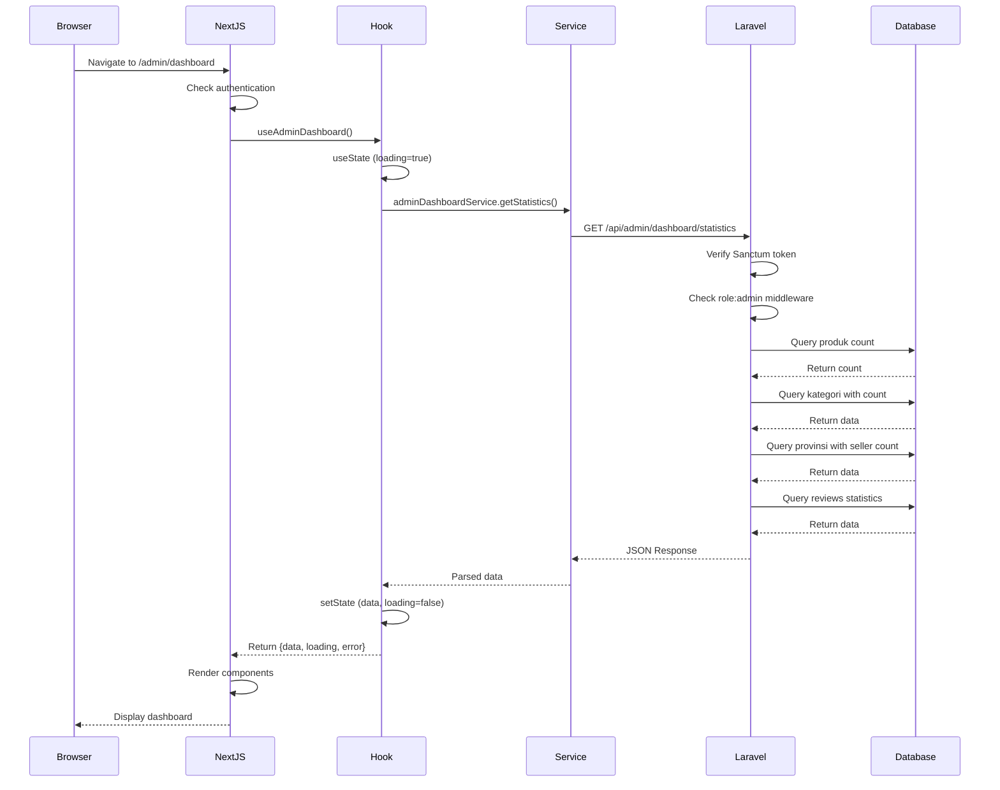
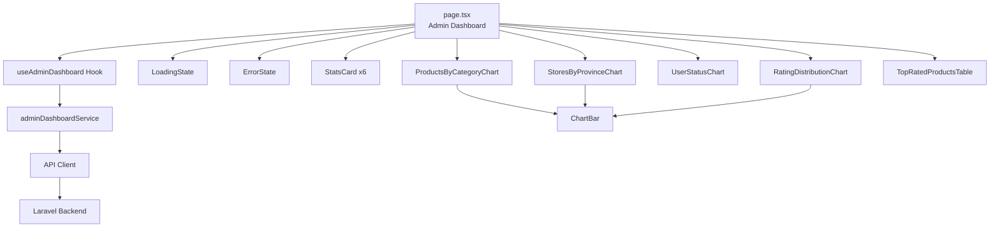
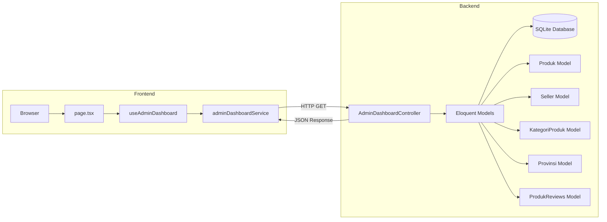
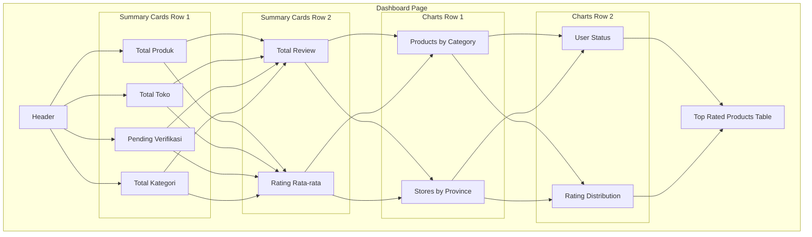
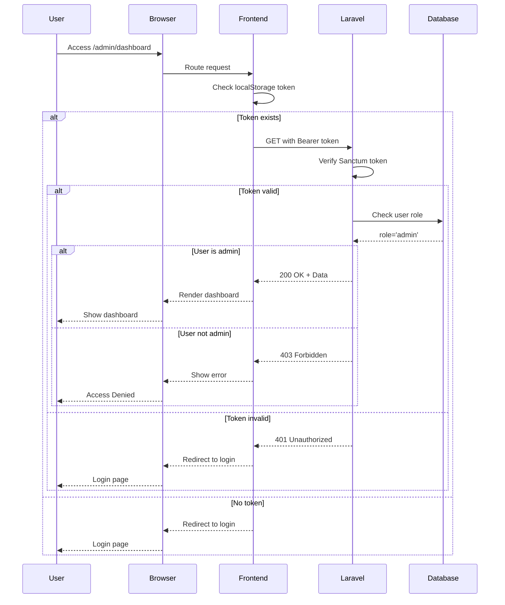
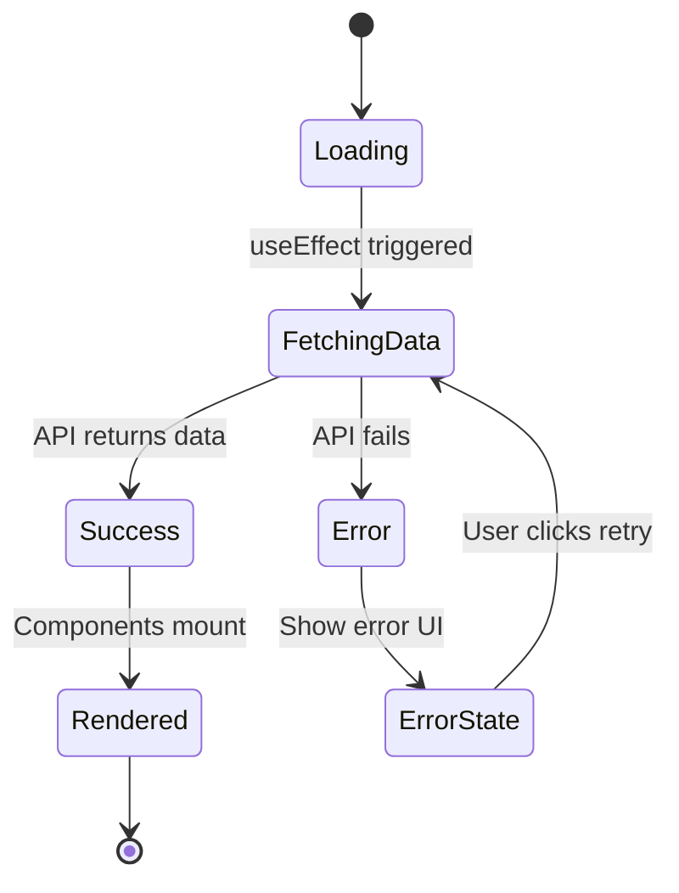
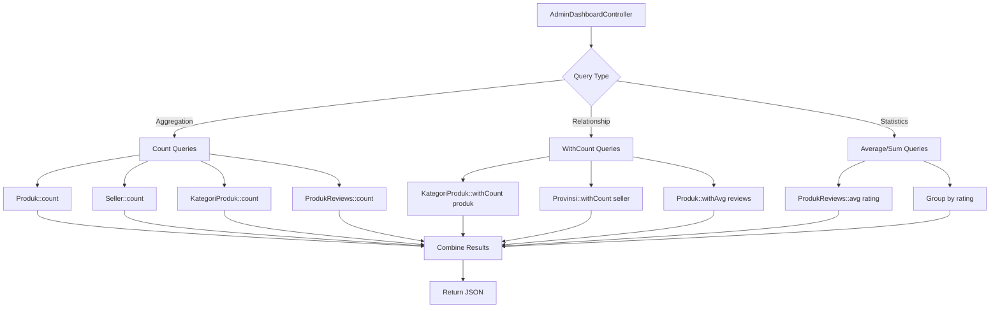
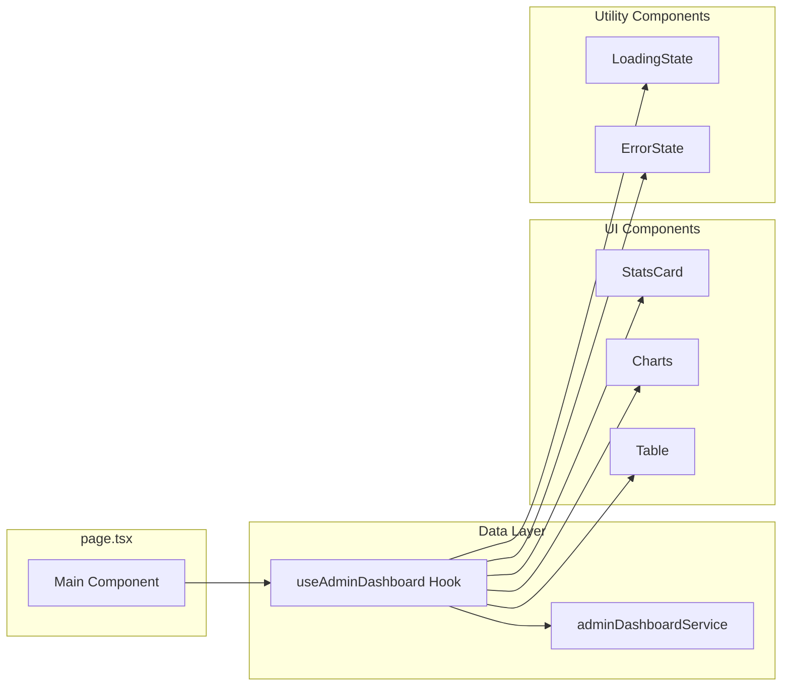
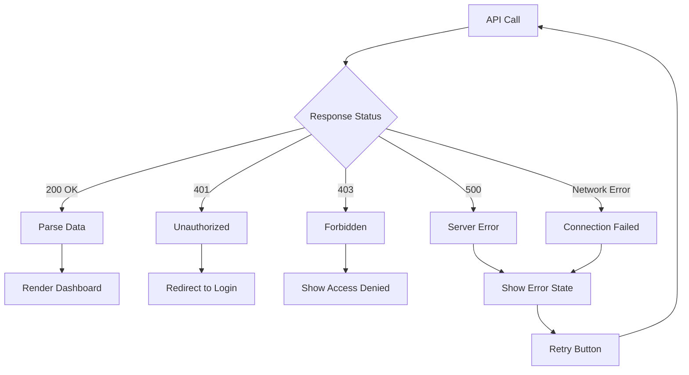

# Admin Dashboard Architecture

## System Flow Diagram



## Component Hierarchy



## Data Flow Architecture



## Dashboard Layout Structure



## Authentication Flow



## State Management Flow



## Database Query Strategy



## Component Interaction



## Responsive Design Breakpoints

```mermaid
graph LR
    subgraph Mobile < 768px
        A1[1 Column<br/>All Components Stack]
    end

    subgraph Tablet 768-1024px
        B1[2 Columns<br/>Stats Cards]
        B2[1 Column<br/>Charts]
    end

    subgraph Desktop > 1024px
        C1[4 Columns<br/>Stats Row 1]
        C2[2 Columns<br/>Stats Row 2]
        C3[2 Columns<br/>All Charts]
    end
```

## Error Handling Strategy



---

These diagrams illustrate the complete architecture of the Admin Dashboard feature, from data flow to component hierarchy to error handling strategies.
